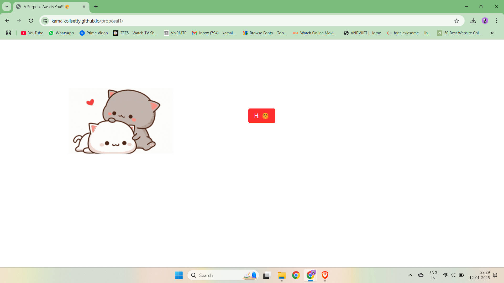
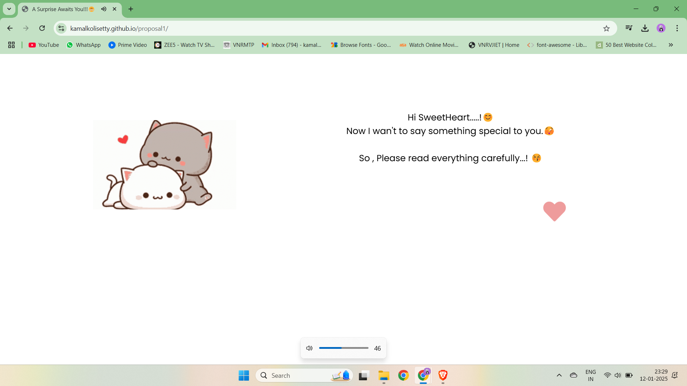
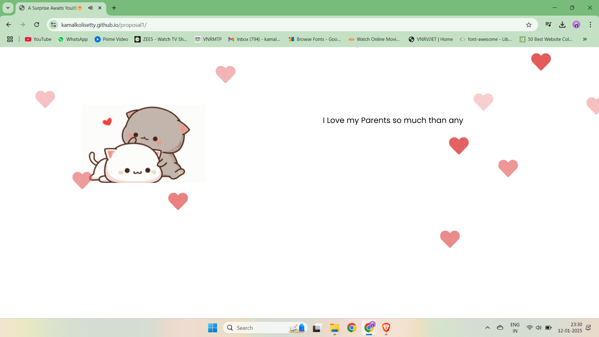
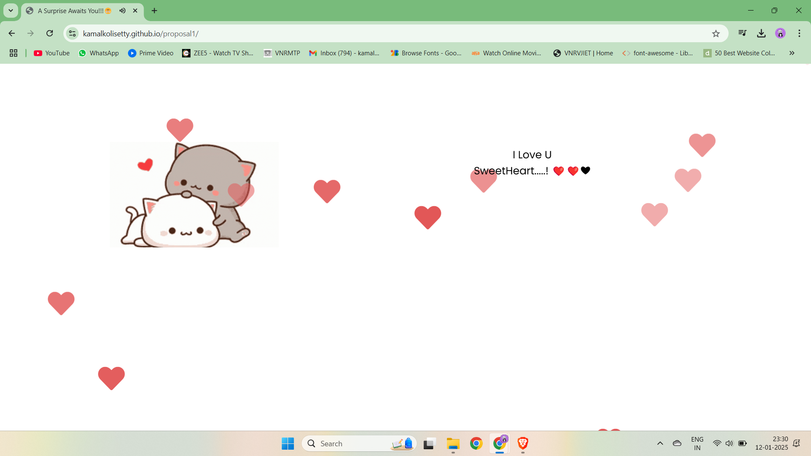
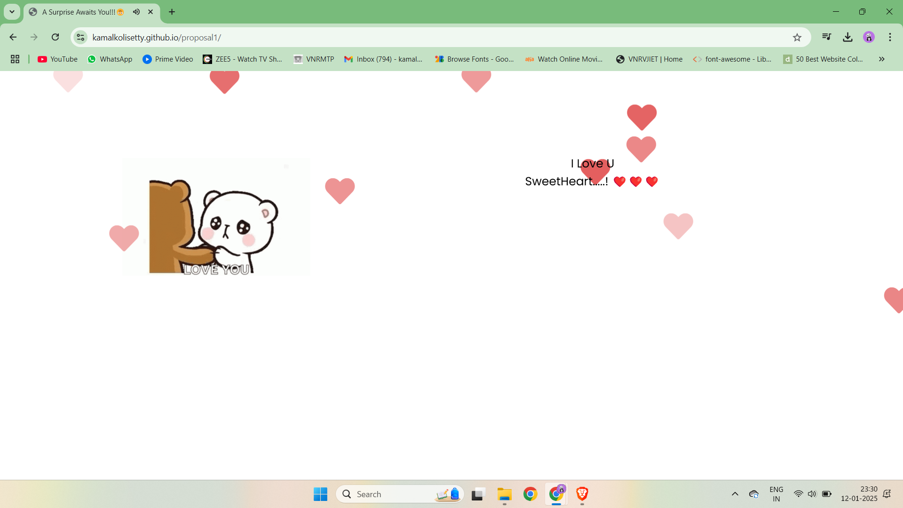

 

# 💖 Surprise Proposal Animation with Floating Hearts 💖

## Overview

The **Surprise Proposal Animation** project creates a magical and heartfelt proposal experience using HTML, CSS, and JavaScript. With dynamic animations, typewriter effects, and romantic floating hearts, this project is designed to leave an unforgettable impression. 🌟

👉 **Check out the live version here**: [Surprise Proposal Animation 🌐](https://kamalkolisetty.github.io/proposal1/)  

🎶 **Background Music**:  
The animation is enhanced by the beautiful song *"Em Sandeham Ledu"* from the movie *Oohalu Gusagusalade*.  
Listen to it here: [YouTube Link 🎵](https://youtu.be/1rcZUAAnd1M?si=EE5eH4rOoGeRJ-JB)  

---

## ✨ Features

- 🖋️ **Typewriter Effect**: A personalized message appears letter by letter for a dramatic reveal.
- 💕 **Floating Hearts**: Romantic hearts float across the screen, adding a dreamy vibe.
- 📱 **Responsive Design**: Works beautifully on all devices — mobile, tablet, or desktop.
- 🎨 **Dynamic Backgrounds**: Changes based on the typewriter message for added visual appeal.
- 🎵 **Background Music**: Loops continuously to set the perfect mood.

-


## 🛠️ Files Included

- `index.html`: The structure of the page.
- `styles.css`: Custom CSS for animations and responsive layouts.
- `script.js`: Handles animations, typewriter effects, and background changes.

---

## 💡 How It Works

1. **Typewriter Effect**  
   - Reveals a message character by character.  
   - Special characters trigger unique events:
     - `<` adds a line break.
     - `>` clears the text.
     - `|` switches to a romantic background and speeds up heart animations.
     - `9` sets a device-specific background image.

2. **Floating Hearts Animation**  
   - Smoothly animated hearts float across the screen.  
   - CSS keyframes handle the movement and fade-out effects.

3. **Dynamic Backgrounds**  
   - Triggered by specific characters, such as `|` and `9`, which change the background dynamically.  
   - Backgrounds are responsive and adjust for mobile and desktop displays.

4. **Background Music**  
   - The romantic song *"Em Sandeham Ledu"* plays in a continuous loop.  
   - Starts when the user interacts with the animation (e.g., clicking the "Hi" button).  

---

## 🌟 How to Use

1. Clone the Repository:  
   ```bash
   git clone https://github.com/kamalkolisetty/proposal1.git
   cd proposal1
   ```

2. Open the `index.html` file in a browser.  

3. Customize the Content:  
   - **Backgrounds**: Update the URLs in `script.js`.  
   - **Message**: Modify the `txt1` variable for your unique message.  
   - **Music**: Replace the `src` in `<audio>` with your preferred track.

---

## 🌈 Responsive Design  

- **Mobile**: Automatically adjusts backgrounds and layout for smaller screens.  
- **Desktop**: Provides high-resolution backgrounds for larger displays.

---

### Sneak Peak into how it looks like....
















## 🎨 Contribute  

Feel free to contribute and make this project even better:  
- Report bugs or issues.  
- Submit pull requests for improvements.  

---

## 🙏 Acknowledgements  

- **Font Awesome**: For the heart icons.  
- **Google Fonts**: For beautiful typography.  
- **YouTube**: For hosting the song *"Em Sandeham Ledu"*.

